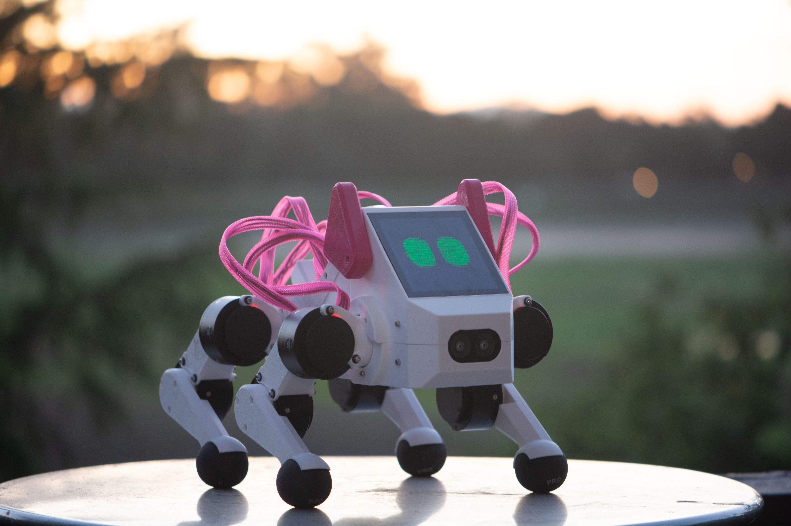

CS 123: A Hands-On Introduction to Building AI-Enabled Robots
#######################################################

    Pupper Robot

**2023 Teaching team:** 

* Instructors: `Prof. Karen Liu <https://tml.stanford.edu/people/karen-liu>`_ (Stanford CS), `Jie Tan <https://www.jie-tan.net/>`_ (Google DeepMind), `Stuart Bowers <https://handsonrobotics.org/>`_ (Hands-On Robotics)
* Co-Instructors: `Wenhao Yu <https://wenhaoyu.weebly.com/>`_ (Google DeepMind), `Tingnan Zhang <https://www.linkedin.com/in/tingnanzhang/>`_ (Google DeepMind)
* Head TAs: `Ankush Dhawan <https://www.linkedin.com/in/ankush-dhawan/>`_ (MS EE 2025), `Zipeng Fu <https://zipengfu.github.io/>`_ (PhD CS 2025)
* TAs: `Jaden Clark <https://jadenvc.github.io/>`_ (CS 2024), `Josh Francis <https://www.linkedin.com/in/josh--francis/>`_ (CS 2024), `Akemi Sabatier <https://www.linkedin.com/in/akemisab/>`_ (ME 2026), `Zara Rutherford <https://www.linkedin.com/in/zara-rutherford-2a18a31b2/?originalSubdomain=be>`_ (EE 2026), 

**Overview:**

Welcome to the course page for Stanford’s course in legged robots!

This course offers a hands-on introduction to AI-powered robotics. Unlike most introductory robotics courses, students will learn essential robotics concepts by constructing a quadruped robot from scratch and training it to perform real-world tasks such as navigation and command following. The course covers a broad range of topics critical to robot learning, including motor control, forward and inverse kinematics, system identification, simulation, and reinforcement learning. Through weekly labs, students will construct and program an agile robot quadruped named Pupper. In the final few weeks, students will undertake an open-ended project, such as training Pupper to perform agile movements, developing a vision system to allow Pupper to play fetch, or adapting large language models to enable Pupper’s ability to communicate with humans. Researchers from Google DeepMind, Hands-On Robotics, and Toyota Research Institute will give lectures during the quarter on their work teaching robots new skills using reinforcement learning.

*“Empowering robots with AI is essential to make them smart and useful in people’s daily life. It is one of the most important research directions in both academia and industry. This class teaches the most relevant skills, gives students hand-on experiences, and prepares them for a career in the area of AI and robotics.”* - Jie Tan, Staff Research Scientist at Google DeepMind

**Time:** TBA

**Location:** TBA, *in-person attendance required*

**TA Sessions:**

* TBA

**Office Hours:**
TBA

**Prerequisites:**

* CS107 (familiarity with the command line) 

* MATH51/CME100 (understanding of gradients)

* Coding will be majority Python but some C++ (Arduino)

* No robotics experience necessary!!

**Number of credits:** 3

**Grading:** :doc:`../grading_details`

Schedule
===========

+------------------+---------------------------------------------------+-------------------------------------------+------------------+-----------------------------------+
|                  | Lecture                                           | Lab                                       | Lab Due Date     | Other                             |
+==================+===================================================+===========================================+==================+===================================+
| Week 1: 9/25     | :doc:`../schedule/lectures/fall-24/lec-1`         |                                           |                  |                                   |
+------------------+---------------------------------------------------+-------------------------------------------+------------------+-----------------------------------+
| Week 2: 10/2     | :doc:`../schedule/lectures/fall-24/lec-2`         | :doc:`../schedule/labs/fall-24/lab-1`     | TBA              |                                   |
+------------------+---------------------------------------------------+-------------------------------------------+------------------+-----------------------------------+
| Week 3: 10/9     | :doc:`../schedule/lectures/fall-24/lec-3`         | :doc:`../schedule/labs/fall-24/lab-2`     | TBA              |                                   |
+------------------+---------------------------------------------------+-------------------------------------------+------------------+-----------------------------------+
| Week 4: 10/16    | :doc:`../schedule/lectures/fall-24/lec-4`         | :doc:`../schedule/labs/fall-24/lab-3`     | TBA              |                                   |
+------------------+---------------------------------------------------+-------------------------------------------+------------------+-----------------------------------+
| Week 5: 10/23    | :doc:`../schedule/lectures/fall-24/lec-5`         | :doc:`../schedule/labs/fall-24/lab-4`     | TBA              |                                   |
+------------------+---------------------------------------------------+-------------------------------------------+------------------+-----------------------------------+
| Week 6: 10/30    | :doc:`../schedule/lectures/fall-24/lec-6`         | :doc:`../schedule/labs/fall-24/lab-5`     | TBA              |                                   |
+------------------+---------------------------------------------------+-------------------------------------------+------------------+-----------------------------------+
| Week 7: 11/6     | No Lecture! Open Lab Time                         | :doc:`../schedule/labs/fall-24/lab-4`     | TBA              |                                   |
+------------------+---------------------------------------------------+-------------------------------------------+------------------+-----------------------------------+
| Week 8: 11/13    | :doc:`../schedule/lectures/fall-24/lec-7`         | :doc:`../schedule/labs/fall-24/lab-6`     | TBA              | Begin Final Project Proposals     |
+------------------+---------------------------------------------------+-------------------------------------------+------------------+-----------------------------------+
| Week of 11/20    | Thanksgiving Break!                               |                                           |                  | Meet with TAs about Final Project |
+------------------+---------------------------------------------------+-------------------------------------------+------------------+-----------------------------------+
| Week 9: 11/27    | :doc:`../schedule/lectures/fall-24/lec-8`         | :doc:`../schedule/labs/fall-24/lab-7`     | 12/4             | Final Project Proposals Due TBD   |
+------------------+---------------------------------------------------+-------------------------------------------+------------------+-----------------------------------+
| Week 10: 12/4    | No Lecture! Open Lab Time                         | Work on Final Projects!                   |                  |                                   |
+------------------+---------------------------------------------------+-------------------------------------------+------------------+-----------------------------------+
| Finals Week      | Dog Show on TBD at TBD                            |                                           |                  |                                   |
+------------------+---------------------------------------------------+-------------------------------------------+------------------+-----------------------------------+

**References:** :doc:`../reference/references`
    
