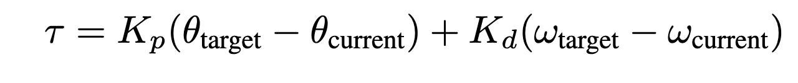

Lab 1: ROS Introduction and Hello PD
====================================
*Goal: Get setup with the hardware, and build a robot arm that you can program PD control on using ROS2.*

Part 0. Setup
___________________________

#. For this class, you will be doing all your coding and development on Raspberry Pi 5s, a minimalistic quad-core single-board computer oftentimes used in robotics projects. The Raspberry Pi will serve as the brain for our Pupper robot, communicating with the electronics board, motor drivers, and camera among other functions. The TAs should distribute a Raspberry Pi 5, pre-flashed micro SD card, a computer monitor, USB keyboard and mouse, power cable, and HDMI cable. 
#. Insert the micro SD card to the slot on the back of the Raspberry Pi. Plug in the USB keyboard and mouse to the USB terminals and connect to the monitor via the HDMI cable and port. Power on the Raspberry Pi with the power cable and see that the desktop turns on. 
#. Make sure that your Raspberry Pi can connect to the class WiFi router, if you are having issues, ask a TA. 

Part 1: ROS Introduction
___________________________

#. For this class, and for many robots you will interface with as a roboticist, we use ROS, or Robot Operating System. ROS allows us to build robotic applications by  providing tools, libraries, and conventions that allow different parts of the robot to interact with each other. 
#. Navigate to :doc:`../../lectures/fall-24/ros_intro` to get acquainted with the basics of ROS. Keep this guide handy to be a ROS cheat sheet that you can refer to throughout the course. You may do this on your personal laptops or the Raspberry Pi. 

Part 2: Robot Leg Assembly
___________________________

#. TODO: Write out assembly instructions
#. TODO: Write out instructions on setting motor ids

Part 3: Hello PD
___________________________

Step 1: Setup Lab 1 Code Base
^^^^^^^^^^^^^^^^^^^^^^^^^^^^^^

1. Start by cloning the lab 1 code repo on the Raspberry Pi and building the package. 

``cd ~/ros2_ws/src``

``git clone <LAB 1 STARTER CODE REPO>``

``git submodule init``

``git submodule update``

``cd ~/ros2_ws``

``colcon build <LAB 1 STARTER CODE PACKAGE``

**NOTE: Notice that all the code for the pupper runs under the workspace ``ros2_ws``. Every lab will have a package that you will clone into the ``src`` directory of the workspace, and you will build the package from inside the main workspace folder.**

2. Open the workspace in VSCode

``code ~/ros2_ws``

3. Examine where in the code the motor angle and velocity are read in ``<lab1_package/lab_1.py>``. Examine where the motor is commanded.

**NOTE** In ROS2 code, there are two central functions to pay attention to. There are publishers and subscribers of topics defined in the ``__init__`` section of the node definition. Publishers publish a message to a topic, and subscribers listen to the messages that are sent to that topic. Callback functions are run when new information is published to a topic. Pay attention to how these publishers and subscribers interface in a ROS program.  

**DELIVERABLE: Before running your code, write what you understand about the publishers and subscribers in your lab document. What gets sent and received on each message publish? How does this correspond to what is physically commanded in the motor?**

Step 2: Run Starter Code
^^^^^^^^^^^^^^^^^^^^^^^^^^^^^^

To run the starter code, we launch the lab1 launch file. The launch file runs the nodes that are specified in its launch description. 

1. In lab_1_launch.py, complete the launch description to launch the node that is defined in lab_1.py. 

2. Run your code, and make sure that PD control is enabled on the leg you have just built. 

``cd ~/ros2_ws``

``ros2 launch <lab1_package_name> <lab1_launch.py>``

**NOTE: Top stop your ros2 program, you can run CTRL+C, just like terminating a regular command line run program**

Step 3: Run Bang-Bang Control
^^^^^^^^^^^^^^^^^^^^^^^^^^^^^^

TODO: UPDATE THIS FOR ROS2 CODE
#. Examine the function ``bang_bang_control()`` in ``src/main.cpp`` and understand what it does. It is called in the ``updateCmd()`` function. ``updateCmd()`` is then called every iteration of ``loop()``.
#. Uncomment the bang-bang code in ``updateCmd()`` and upload.
#. Observe the effects of changing the current command to something else. Reminder, bang_bang_control returns a commanded current.
#. *FEEL* how the controller behaves. Move the dial by hand and see how the controller reacts.

TODO: INSERT VIDEO OF EXAMPLE BANG-BANG CONTROL
*Example bang-bang control.*

**DELIVERABLE: Take a video of your bang bang control to upload to Gradescope with your submission**

Step 4. Write P proportional control
^^^^^^^^^^^^^^^^^^^^^^^^^^^^^^^^^^^^
TODO: UPDATE FOR ROS2 PUPPER

#. Comment out the bang-bang controller. 
#. Take a look at the pd_control function in ``src/main.cpp``. Notice that there are two parts summed together: proportional_control and derivative_control. They are the individual terms of the PD control law. 
#. Complete the proportional_control function in ``src/main.cpp``. Your function should return an electrical current command (100mA, 200mA etc) using the PD control law using the following update equation. In this case, we are not conducting any damping on the control current, so leave that as 0. 

    
    PID Update Equation. ``Tau`` is the commanded electrical current for the motor, ``theta_target`` is the target angle, ``omega_target`` is the target angular velocity, ``theta_current`` is the motor angle, and ``omega_current`` is the motor angular velocity. ``Kd`` and ``Kp`` are the derivative and proportional gains - these are dimensionless coefficients that you will experimentally determine through trial and error. 

Questions:

#. Start with Kp = 1000.0 and leave Kd as is. Don't forget the negative signs! 
#. Upload code to Teensy
#. *FEEL* the effect of the P controller.
#. What happens when you rotate the disc just a little bit away from the target position? What happens when you rotate it a lot away from the target position? Do you feel the motor torque increase and then flatten out as you rotate the disc? 
#. What changes when you change Kp?

**DELIVERABLE: Answer these last two questions in your lab document**

Step 5. Write PD position control
^^^^^^^^^^^^^^^^^^^^^^^^^^^^^^^^^^

TODO: UPDATE FOR ROS2 PUPPER

#. Next, complete the derivative_control in ``src/main.cpp``. This should work with your proportional_control in pd_control to create a more full PD controller. Again, follow the above update equation, outputting an electrical current in ``tau``.

Questions:

#. After adding in the derivative term, use Kp = 1000.0 and Kd = 10.0 to start. Don't forget the negative signs! How does this controller perform compared to just P control?
#. Upload code to Teensy
#. *FEEL* the effect of the PD controller.
#. Change around the values for Kp and Kd, experimenting with how they change the performance. What happens now when you rotate the disc farther from the target position? Why does adding the derivative term help the controller’s performance? Find the optimal Kp and Kd values. 

**DELIVERABLE: Answer the above questions in your lab document, and report your chosen Kp and Kd values. Take a video of your working PD controller to upload to Gradescope**

Step 6. Experiment with different parameters
^^^^^^^^^^^^^^^^^^^^^^^^^^^^^^^^^^^^^^^^^^^^^

TODO: UPDATE FOR ROS2 PUPPER

Note: Some of these steps will cause the output disc to go unstable and violently shake, be prepared!

For each of these situations (except the ones that go unstable), rotate the disc around with your hand to get a physical sense for the PD behavior. Report on your findings for each of these in your lab document.

#. Keeping Kd constant (0), experiment with Kp = -100 and Kp = 5000. Discuss with your partner how each feels. Report how Kp and stiffness related?
#. Keeping Kp constant (1000), experiment with different Kd values from -10 to 1000. Report what happens.
#. Report what happens when Kp is too high. Try Kp=50000 and Kd=100.
#. Report what happens when Kd is too high. Try Kp=0 and Kd=100000.
#. Report what happens with just moderate damping. Try Kp=0 and Kd=100. 

**DELIVERABLE: Report your findings in your lab document**

The expected behavior is that higher Kp values will make the position control more stiff while higher Kd values will make the motor slower to achieve the desired position.
If either gain is too high or is negative, the motor will go unstable.

Step 7. Experiment with different loop rates
^^^^^^^^^^^^^^^^^^^^^^^^^^^^^^^^^^^^^^^^^^^^^

TODO: UPDATE FOR ROS2 PUPPER

Report on your findings for each of these in your lab document
#. Examine where the code is checking if it's time to issue another control update.
#. Change the update rate to 4Hz with Kp=1000 and Kd=100 to observe instability. Reminder, 1Hz = 1/seconds. 

**DELIVERABLE: Report how increasing/decreasing the update frequency affects the controller's performance.**

**WARNING, decreasing the update frequency by too much can cause dangerous behavior.**

Step 8. Program periodic motion
^^^^^^^^^^^^^^^^^^^^^^^^^^^^^^^^^^^

TODO: UPDATE FOR ROS2 PUPPER

1. Set the update rate back to 200Hz (5ms interval).
2. Program the motor to track a sinusoidal position, like the psuedocode below. 

.. code-block:: c++

    float time = millis() / 1000.0
    position_target = sin(time)

3. Play around with different frequencies. How high can you raise the frequency before the motor no longer moves as much as you expect? 

**DELIVERABLE: Take a video to upload to Gradescope with your submission of periodic motion**

Fun fact, the maximum frequency you can go before the motor moves to only 71% (-3dB) of the intended motion is called the bandwidth.

Congrats on finishing your first lab!
