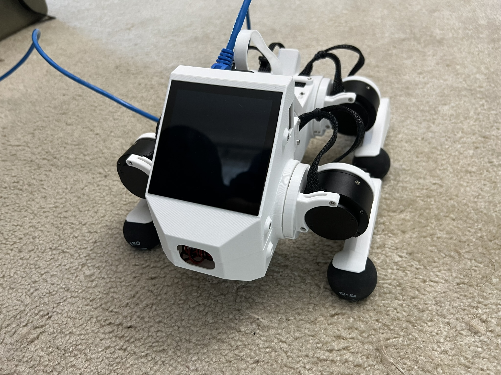

Lab 1: ROS Introduction and PD Control
======================================

Goal
----
Get set up with the Raspberry Pi 5 hardware and build a robot leg that you can program PD control on using ROS2.

Part 0: Setup
-------------

1. For this class, you will be doing all your coding and development on Raspberry Pi 5s, a minimalistic quad-core single-board computer often used in robotics projects. The Raspberry Pi will serve as the brain for our Pupper robot, communicating with the electronics board, motor drivers, and camera among other functions.

2. You should receive the following from the TAs:

   - Pupper robot: containing Raspberry Pi 5, Pre-flashed micro SD card and etc.
   - Ethernet cable
   - HDMI cable

3. Connect to the Pupper robot via SSH, which stands for Secure Shell, is a network protocol that provides a secure way to access and manage remote computers over an unsecured network. It offers strong authentication and encrypted data communications between two computers connecting over an open network such as the internet. 
    - Connect your laptop to the Pupper robot using the Ethernet cable.
    - Enable internet sharing in system settings (turn on anything that looks like Ethernet).
    - SSH into the Raspberry Pi through terminal: ``ssh pi@pupper.local`` (password: rhea123)
    - Remember to turn off internet sharing afterwards.

.. figure:: ../../../_static/internet_sharing.png
    :align: center

    Enable internet sharing in system settings.

4. In this course, we use VSCode as our primary development environment. You can use VSCode to edit code on your Raspberry Pi and run it directly on the robot. To set up VSCode on your Raspberry Pi, follow the instructions in the VSCode ssh setup guide (https://code.visualstudio.com/docs/remote/ssh#_connect-to-a-remote-host).

Part 1: ROS Introduction
------------------------

1. We'll be using ROS (Robot Operating System) throughout this course. ROS provides tools, libraries, and conventions that facilitate building robotic applications and allow different parts of the robot to interact with each other.

2. Familiarize yourself with the basics of ROS by reviewing the ROS introduction guide (https://wiki.ros.org/ROS/Introduction). Keep this guide handy as a ROS2 cheat sheet (https://github.com/ubuntu-robotics/ros2_cheats_sheet/tree/master) that you can refer to throughout the course.

3. ROS services in Pupper: robot.service manages control code (face controller, rl or heuristic controller, etc). See if controller is running: ``systemctl status robot.service`` You should see the status as "active (running)". Checkout all topics and services: ``ros2 topic list`` and ``ros2 service list``.

4. Remember to disable the robot service before working on your code. This will prevent the robot from running any pre-existing code that may interfere with your work. Pupper robot falls after disable the robot service, so make sure to place it on a soft surface. To disable the robot service, run the following commands:

.. code-block:: bash

   sudo systemctl disable robot.service
   sudo reboot

5. Calibration after rebooting: After rebooting, you may need to recalibrate the robot joints. Follow the following image:

    Calibration after rebooting.

5. Troubleshooting. If you encounter any issues with , try the following:

  - If you see "ros_2 not found", ``source ~/.bashrc`` again

Part 2: Hello PD
----------------

Step 1: Setup Lab 1 Code Base
^^^^^^^^^^^^^^^^^^^^^^^^^^^^^

1. Clone the lab 1 code repository on the Raspberry Pi and build the package:

   .. code-block:: bash

      cd ~/
      git clone https://github.com/cs123-stanford/lab_1_2024.git lab_1

   Note: Make sure the folder name is ``lab_1``. If you have a different folder name, you may need to update the launch file accordingly.

2. Open the workspace in VSCode

3. Examine ``<lab_1/lab_1.py>`` to understand where the motor angle and velocity are read and where the motor is commanded.

   Note: In ROS2 code, pay attention to publishers and subscribers defined in the ``__init__`` section of the node definition. Publishers send messages to topics, while subscribers listen to messages on topics. Callback functions run when new information is published to a topic.

**DELIVERABLE:** Before running your code, explain in your lab document what you understand about the publishers and subscribers. What gets sent and received on each message publish? How does this correspond to what is physically commanded in the motor?

Step 2: Run ROS Launch Code
^^^^^^^^^^^^^^^^^^^^^^^^^^^

1. Check the launch description in ``lab_1_launch.py`` and ``lab_1.yaml``. Familiarize yourself with the structure and parameters defined in these files.

2. Run the launch file using the following command:

   .. code-block:: bash

      ros2 launch lab_1 lab_1.launch.py

   This command will start all the necessary nodes for your PD control experiment.

3. After running the launch file, you should see output in your terminal indicating that the nodes have been started successfully. If you encounter any errors, double-check your file paths and make sure all dependencies are installed.

4. Open a new terminal window (you can use SSH to open multiple connections to your Raspberry Pi) and run the following command to see the list of active topics:

   .. code-block:: bash

      ros2 topic list

   You should see topics related to joint states and commands. These are the topics your node will be publishing to and subscribing from.

5. To inspect the data being published on a specific topic, you can use the `ros2 topic echo` command. For example:

   .. code-block:: bash

      ros2 topic echo /joint_states

   This will show you real-time data about the joint states of your robot leg.

**DELIVERABLE:** In your lab document, provide screenshots of:

1. The terminal output after running the launch file, showing successful node startup.
2. The list of active topics you observed.
3. A sample of the joint states data you saw when using the `ros2 topic echo` command.

Also, answer the following questions:

1. What nodes are being launched by your `lab_1.launch.py` file?
2. What parameters are being set in the `lab_1.yaml` file, and what do you think they control?
3. Based on the topics you observed, how do you think the different parts of your robot control system are communicating with each other?

Remember, understanding how the launch system works and how to inspect your ROS2 system is crucial for debugging and developing more complex robotic systems in the future.

Step 3: Implement PD Control
^^^^^^^^^^^^^^^^^^^^^^^^^^^^

1. Open ``lab_1.py`` and locate the PD control implementation.

2. Start with Kp = 2.0 and Kd = 0.3. Implement the PD control law using the following update equation:

   .. code-block:: python

      tau = Kp * (theta_target - theta_current) + Kd * (omega_target - omega_current) + feedforward_term

   Where:
   
   - ``tau`` is the commanded torque for the motor
   - ``theta_target`` is the target angle
   - ``omega_target`` is the target angular velocity (usually 0)
   - ``theta_current`` is the current motor angle
   - ``omega_current`` is the current motor angular velocity
   - ``Kp`` and ``Kd`` are the proportional and derivative gains
   - ``feedforward_term`` is a constant term that you can use send a constant torque to the motor

3. Run your code ``python lab_1.py`` and observe the behavior of the PD controller.

**DELIVERABLE:** Answer the following questions in your lab document:

- How does the leg respond to manual movements?
- What happens when you change Kp and Kd values?
- Find and report the optimal Kp and Kd values for your setup.

Step 4: Experiment with Different Parameters
^^^^^^^^^^^^^^^^^^^^^^^^^^^^^^^^^^^^^^^^^^^^

Experiment with different Kp and Kd values and observe the effects. Be prepared for potential instability!

For each situation, manually rotate the leg to get a physical sense of the PD behavior. Report your findings in your lab document.

1. Vary Kp while keeping Kd constant (0.1). Try Kp values from 0.5 to 5.0.
2. Vary Kd while keeping Kp constant (2.0). Try Kd values from 0.1 to 1.0.

**DELIVERABLE:** Report your findings for each experiment in your lab document.

Step 5: Experiment with Delays in the System
^^^^^^^^^^^^^^^^^^^^^^^^^^^^^^^^^^^^^^^^^^^^

1. Introduce a delay in the system by adding a buffer in the current motor angle and velocity readings. This simulates the delay in the physical system.
2. Experiment with different delay values (e.g., 0.1, 0.5 seconds).

   .. code-block:: python
      # In your initialization:
      self.delay_buffer_size = int(delay_seconds * control_frequency)
      self.angle_buffer = deque(maxlen=self.delay_buffer_size)
      self.velocity_buffer = deque(maxlen=self.delay_buffer_size)

      # In your control loop:
      self.angle_buffer.append(joint_pos)
      self.velocity_buffer.append(joint_vel)
      joint_pos = self.angle_buffer[0]
      joint_vel = self.velocity_buffer[0]

**DELIVERABLE:** Report your findings in your lab document. How does the delay affect the performance of the PD controller?

Step 6: Implement Periodic Motion
^^^^^^^^^^^^^^^^^^^^^^^^^^^^^^^^^

1. Program the leg to track a sinusoidal position:

   .. code-block:: python

      import time
      import math

      current_time = time.time()
      joint_pos_desired = math.sin(current_time)

2. Experiment with different frequencies of the sine wave.

**DELIVERABLE:** Take a video of the leg performing periodic motion and upload it to Gradescope with your submission.

Step 7. Run bang-bang control
^^^^^^^^^^^^^^^^^^^^^^^^^^^^^^
1. Remove the code in the Step 5 and implement the bang-bang control. Bang-bang control is a simple control strategy where the control input is either on or off. In this case, the control input is either the maximum torque or zero torque. The control input switches when the motor angle crosses a threshold.
2. Implement the bang-bang control law using the following update equation:
   
   .. code-block:: python

      toruqe_command = 1.0
      if joint_pos < joint_pos_desired:
         torque = toruqe_command
      else:
         torque = -toruqe_command

**DELIVERABLE: Take a video of your bang bang control to upload to Gradescope with your submission**

Additional Notes
----------------
- ROS2 Workspace:

  - All robot-relevant code is in ``ros2_ws``
  - Key packages:

    - Neural controller (policy support)
    - Hardware interface (motor control)
    - Pupper feelings (face control)
    - Pupper descriptions (URDF files)

- Motor Control:

  - Refer to the control node and joy node
  - URDF is the source of truth for CAN IDs
  - Joint states topic provides current motor states

Congratulations on completing your first lab! This hands-on experience with ROS2 and PD control on a real robot leg will serve as a foundation for the more advanced topics we'll cover in future labs.
