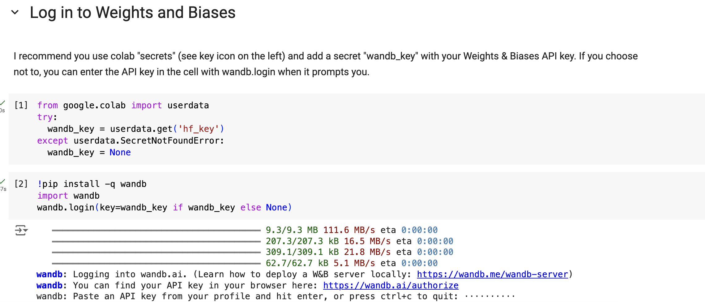
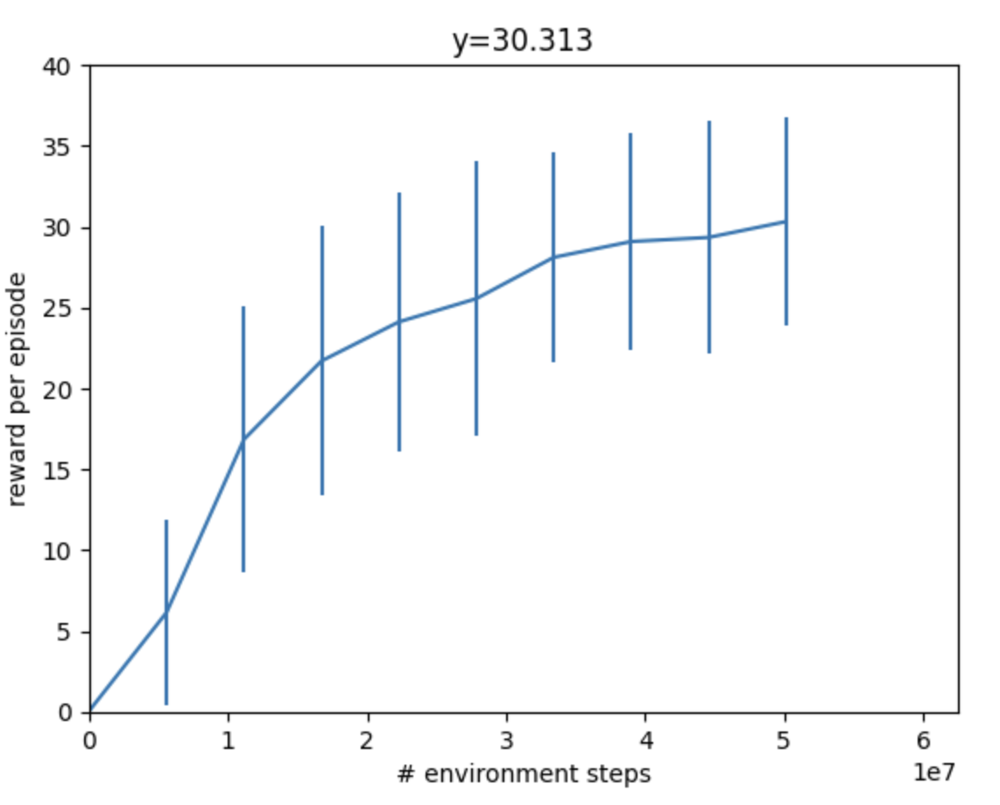

Lab 5: How to Train Your Dog
========================

*Goal: Train Pupper to walk using reinforcement learning!*

Step 1. Colab setup
^^^^^^^^^^^^^^^^^^^^^^^^^^^^^^^^^^^^^^^^
#. Make a copy of the Colab notebook `HERE <https://colab.research.google.com/drive/1QBtJ09hNInqNqKPVRThbv_yppSlQ9qd2#scrollTo=cHJCbESGA7Rk>`_
#. Purchase Colab Pro and set the GPU to A100
#. Create a wandb account (https://wandb.ai/), navigate to User Settings, and generate an API key
#. Set up your wandb key by running cell 2 and inserting your key
#. Run all cells up until Config to install dependencies

   Insert your wandb key here

Step 2. Pupper forward
^^^^^^^^^^^^^^^^^^^^^^^^^^^^^^^^^^^^^^^^
#. Edit tracking_lin_vel in the reward config to make Pupper walk forward!
#. Run the ENVIRONMENT and TRAIN cells to load in the Pupper flat environment and train Pupper to stand up
#. Pupper should take around 5-10 minutes to train. 

DELIVERABLE: Visualize Pupper's progress every ~100 episodes. How does Pupper look 100 episodes in? How does this relate to the reward you coded?

DELIVERABLE: Screen recording of stand-up in simulation

.. figure:: ../../../_static/random_walk.gif
   :align: center
   :width: 360px

   Earlier in training, Pupper will move seemingly randomly

   During training, your reward should be going up steadily and eventually plateau

.. figure:: ../../../_static/crazy_walk.gif
   :align: center
   :width: 360px

   Just because Pupper has velocity tracking reward doesn't mean it will perfectly follow the desired speed. To learn natural gaits, auxiliary rewards are needed. Next, you will implement a function to encourage Pupper to walk more efficiently.

Step 3. Effort function
^^^^^^^^^^^^^^^^^^^^^^^^^^^^^^^^^^^^^^^^
#. Complete the reward config cell to write a reward function that helps Pupper conserve effort. Which rewards should be nonzero to encourage Pupper to conserve energy?
#. Run the ENVIRONMENT and TRAIN cells to load in the Pupper flat environment and train Pupper to walk forward more efficiently
#. Pupper should take around 5-10 minutes to train. 

DELIVERABLE: What is your reward function (in math)? Why did you choose this function? What existing rewart terms could be used be used to make Pupper conserve energy, and what are their potential pros and cons? Are there any rewards that could be used that are not listed?
DELIVERABLE: Qualitatively, how does this Pupper policy compare to the previous one?
DELIVERABLE: Screen recording of stand-up in simulation

.. figure:: ../../../_static/effortless_walk.gif
   :align: center
   :width: 360px

   Pupper should walk with much better stability and smoothness. However, it still shouldn't have a super natural locomotion, and will likely not be robust to pushes or other changes in the environment. Next, you will implement several additional auxiliary rewards to help Pupper stay stable.

Step 4. Reward tuning
^^^^^^^^^^^^^^^^^^^^^^^^^^^^^^^^^^^^^^^^

#. Write a reward function that makes Pupper move forward in the reward config. Feel free to use any rewards you like
#. Reload the environment, and train Pupper to walk in sim
#. Pupper should take around 10-15 minutes to train. 

DELIVERABLE: What terms are included in your reward functions? What coefficients did you use? How did you come up with these terms and what was their desired effect? Why might this policy perform poorly on the physical robot?

DELIVERABLE: Visualize Pupper's progress every ~100 episodes. How does Pupper look 100 episodes in? How does this relate to the reward you coded?

DELIVERABLE: Screen recording of stand-up in simulation

.. figure:: ../../../_static/flat_fast.gif
   :align: center
   :width: 360px

   You should aim to train a stable policy up to 0.75 m/s in simulation

Step 5. Deploy your walking policy
^^^^^^^^^^^^^^^^^^^^^^^^^^^^^^^^^^^^^^^^

|
Transfer policy from local machine to pupper
#. When you train a policy that can standup and stay stable, you are ready to transfer the policy to the physical Pupper robot
#. Navigate to archive in wandb, and download the .json from the policy you trained
#. ‘scp [path_to_model_name.json] pi@pupper.local:’ (note the colon at the end)

#. In local neural_controller repo, change the policy called in policy.py (ros2_ws folder) to your policy name (your .json file)
#. On the pi, run the launch.py script

DELIVERABLE: In what ways is this policy different on the physical robot (compared to sim)

DELIVERABLE: Take video of walking

.. figure:: ../../../_static/walker.gif
   :align: center

   Deploy your policy on Pupper v3

Step 5. Domain randomization
^^^^^^^^^^^^^^^^^^^^^^^^^^^^^^^^^^^^^^^^^^^^^^^^^^^^^^^^^^^^

Okay, so Pupper looks pretty good in sim, but the policy doesn't look so great in the real world...

You will need to add randomization to the sim environment so your policy successfully transfers. Consider randomizing parameters such as Pupper mass, environment heighfields, or PID gains.

#. Edit the environment config to adequately represent all the situations Pupper might encounter in the real world
#. Test your policy on the obstacle course in office hours

.. figure:: ../../../_static/good_walk_terrain.gif
   :align: center
   :width: 360px

   Your sim environment should expose Pupper to a variety of possible scenarios

DELIVERABLE: Record a video on the obstacle course and record a video

Resources
-----------
`Sim-to-Real: Learning Agile Locomotion For Quadruped Robots <https://arxiv.org/abs/1804.10332>`_

`Minimizing Energy Consumption Leads to the
Emergence of Gaits in Legged Robots <https://energy-locomotion.github.io/>`_

`Learning Agile Quadrupedal Locomotion Over Challenging Terrain <https://www.science.org/doi/full/10.1126/scirobotics.abc5986>`_
